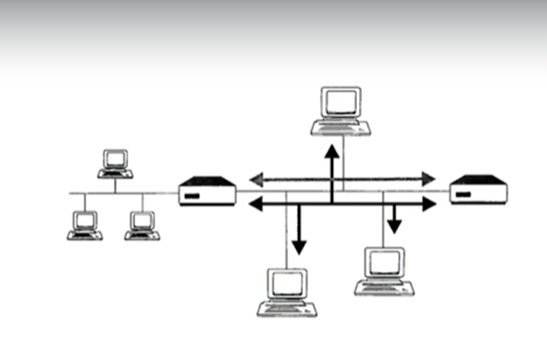

# Firewall

Safeguards networks by monitoring and controlling traffic based on predefined security rules

- Can be hardware/software based
- [[Packet Filtering Firewall]]
- [[Stateful Firewall]]
- [[Proxy Firewall]]

# Screened Subnet (Dual-homed Host)

Acts as a security barrier between external untrusted networks and internal trusted networks, using a protected host with security measures like a packet filtering firewall

# Packet Filtering Firewall

Checks packet headers for traffic allowance based on IP addresses and port numbers

- Can not prevent certain attacks due to limited inspection capabilities in the packet header

# Stateful Firewall

Monitors all inbound and outbound network connections and requests

# Proxy Firewall

Acts as an intermediary between internal and external connections, making connections on behalf of other endpoints

- [[Circuit Level Firewall]]
- [[Application Level Firewall (Layer 7 Firewall)]]

# Circuit Level Firewall

Like a SOCKS firewall, operates at the Layer 5 of the OSI model

# Application Level Firewall (Layer 7 Firewall)

Conducts various proxy functions for each type of application at the Layer 7 of the OSI model

# Kernel Proxy Firewall (Fifth Generation Firewall)

Has minimal impact on network performance while thoroughly inspecting packets across all layers

Examples:
- [[Next Generation Firewall (NGFW)]]
- Unified Threat Management Firewall (UTM)
- Web Application Firewall (WAF)

# Next Generation Firewall (NGFW)

Aims to address the limitations of traditional firewalls by being more aware of applications and their behaviors

- Conducts deep packet inspection for traffic
- Operates fast with minimal network performance impact
- Offers full-stack traffic visibility
- Integrates with various security products
- Single Engine

# Unified Threat Management Firewall (UTM)

Provides the ability to conduct multiple security functions in a single appliance

- Uses separate individual engines

Functions:
 - Network firewalls
 - Network intrusion prevention systems
 - Gateway antivirus and antispam
 - Virtual private network concentration
 - Content filtering
 - Load balancing
 - Data loss prevention

Disadvantage:
- UTM devices are a single point of failure
- Laacks the depth of specialized tools and occasionally exhibits less efficient performance

Advantage:
- Lower upfront costs, maintenance, and power consumption
- Simplified installation and configuration
- Full integration with multiple benefits

# Web Application Firewall (WAF)

- Focuses on the inspection of the HTTP traffic
- Can funtion as standalone appliances or as software integrated into web servers

- [[Inline WAF Configuration]] or [[Out-of-Band WAF Configuration]]

# Inline WAF Configuration
Device sits between the network firewall and the web servers

# Out-of-Band WAF Configuration
Device receives a mirrored copy of web server traffic
- can see information and alerts it but doesnt block it