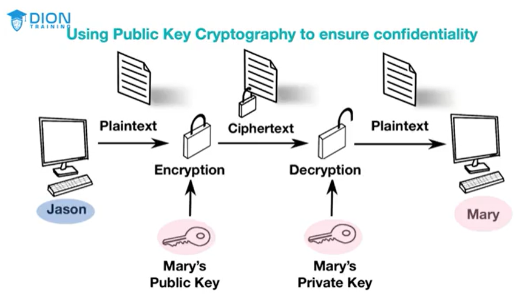

# Cryptography

Practice and study of writing and solving codes to hide the true meaning of the information

[[Encryption]]
- [[Data at Rest]]
- [[Data in Transit/Data in Motion]]
- [[Data in Use]]

# Cipher
An algorith that performs the encryption/decryption

# Key
Essential piece of information that determines the output/input of a cipher

**Encryption strength comes from the [[Key]], not the algorithm**

- Use larger keys and rotate keys frequently
    - The length of a key is proportional to the level of security it provides
    - Regularly change keys

[[Symmetric Encryption]]
- [[Data Encryption Standard (DES)]]
- [[Triple DES (3DES)]]
- [[International Data Encryption Algorithm (IDEA)]]
- [[Advanced Encryption Standard (AES)]]
- [[Blowfish]]
- [[Twofish]]
- [[RC Cipher Suite]]
- [[Rivest Cipher (RC4)]]
- [[Rivest Cipher (RC5)]]
- [[Rivest Cipher (RC6)]]

[[Asymmetric Algorithms]]

  - [[Digital Signature]]
    - Gives [[Confidentiality]]
    - [[Non-repudiation]]
    - [[Integrity]]

- [[Diffie-Hellman (DH)]]
- [[RSA (Ron RIvest, Adi Shamir, and Leonard Adleman)]]
- [[Elliptic Curve Cryptography (ECC)]]
- [[Elliptic Curve Diffie-Hellman (ECDH)]]
- [[Elliptic Curve Diffie-Hellman Ephemeral (ECDHE)]]
- [[Elliptic Curve Digital Signature Algorithm (ECDSA)]]

[[Hybrid Implementation]]
[[Stream Cipher]]
[[Block Cipher]]

- [[Hashing]]
  - [[MD5 (Message Digest Algorithm 5)]]
  - [[SHA-1]]
  - [[SHA-2]]
  - [[SHA-3]]
  - [[RIPEMD (RACE Integerity Primitive Evaluation Message Digest)]]
    - [[RIPEMD-160]]
  - [[HMAC (Hash-based Message Authentication Code)]]
  - [[Digital Security Algorithm (DSA)]]
  - [[Digital Security Standard (DSS)]]

- [[Code Signing]]

**Hash attacks**
- [[Pass the Hash Attack]]
- [[Birthday Attack]]

**To defend against these hash attacks**
- [[Key Stretching]]
- [[Salting]]

**Password guessing attacks**

- [[Dictionary Attack]]
- [[Brute-force Attack]]
- [[Rainbow Tables]]

**To defend against these Password attacks**
- [[Key Stretching]]
- [[Nonce (Number Used Once)]]
- Limited failed login attempts

Review [[Public Key Infrastructure (PKI)]]
- [[Certificate Authority]]
- [[Key Escrow]] may be used for key storage but if hacked will cause alarge leak of data

[[Digital Certificate]]
- [[Wildcard Certificate]]
- [[Subject Alternate Name (SAN) field]]
- [[Single-Sided Certificate]]
- [[Dual-Sided Certificate]]
- [[Self-Signed Certificate]]
- [[Third-Party Certificate]]
- [[Root of Trust]]
- [[Registration Authority (RA)]]
- [[Certificate Signing Request]]
- [[Certificate Revocation List (CRL)]]
- [[OCSP (Online Certificate Status Protocol)]]
- [[OCSP Stapling]]
- [[Public Key Pinning]]
- [[Key Escrow Agents]]
- [[Key Recovery Agent]]

[[Blockchain]]
- [[Public Ledger]]
- [[Smart Contracts]]
- [[IBM]]
- [[Permissioned Blockchain]]

**Encryption Tools**
- [[Trusted Platform Module (TPM)]]
- [[Hardware Security Module (HSM)]]
- [[Key Management System (KMS)]]
- [[Secure Enclave]]

**Obfuscation**
- [[Steganography]]
- [[Tokenization]]
- [[Data Masking]]

[[Cryptographic Attacks]]
- [[Downgrade Attacks]]
- [[Collision Attack]]
- [[Quantum Computing]]
