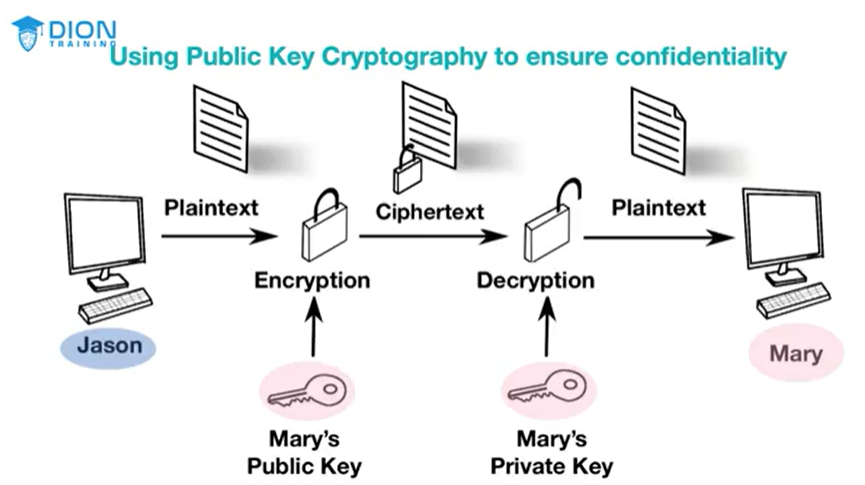

# Asymmetric Algorithms

Use a pair of keys, a public key for encryption and a private key for decryption
    - Only person who can decrypt it is the receiver using their private key
    - Example:
      - [[Diffie-Hellman (DH)]]
      - [[RSA (Ron RIvest, Adi Shamir, and Leonard Adleman)]]
      - [[Elliptic Curve Cryptography (ECC)]]

- [[Digital Signature]]
  - Gives [[Confidentiality]]
  - [[Non-repudiation]]
  - [[Integrity]]

# Diffie-Hellman (DH)

Used to conduct key exchanges and secure key distribution over an unsecure network
- [[Asymmetric Algorithms]]
- Used for key exchange inside of creating a VPN tunnel establishment as part of [[Internet Protocol Security (IPSec)]]

# RSA (Ron RIvest, Adi Shamir, and Leonard Adleman)

Asymmetric Algorithm that relieso n the mathematicla difficulty of factoring large prime numbers

Supports 1024 and 4096 bits

# Elliptic Curve Cryptography (ECC)

Heavily used in mobile devices and its based on the algebraic structure of elliptical curves over finite fields to define its keys.

ECC with a 256-bit key is just as secure as RSA with a 2046-bit key

Most commonly ussed for mobile devices and low-power computing devices

# Elliptic Curve Diffie-Hellman (ECDH)

ECC version of the popular Diffie-Hellman key exchange protocol

# Elliptic Curve Diffie-Hellman Ephemeral (ECDHE)

Uses a different key for each portion of the key establishment process inside the Diffie-Hellman key exchange

# Elliptic Curve Digital Signature Algorithm (ECDSA)

Used as a public key encryption algorithm by the US Government in their digital signatures