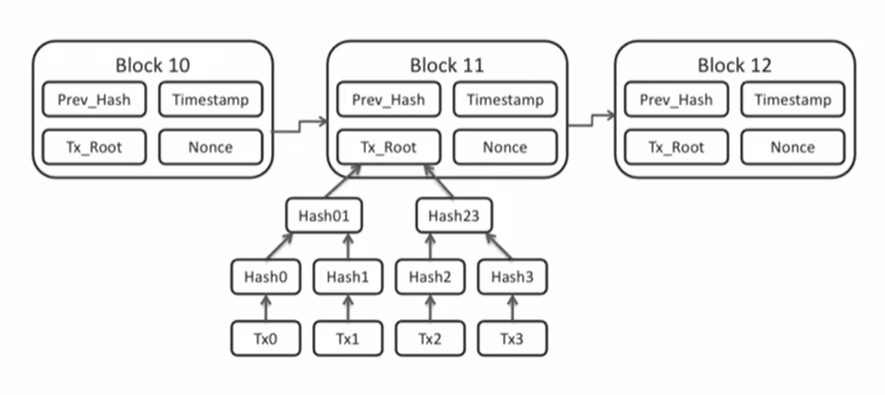
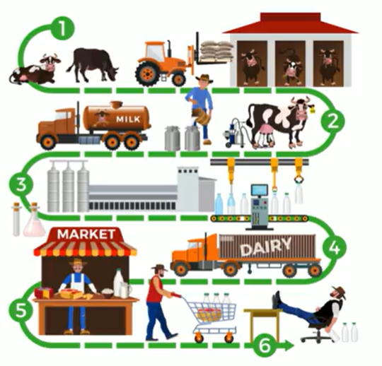

# Blockchain

A shared immutable ledger for recording transactions, tracking assets, and building trust

- A blockchain is a really long series of information with each block containing information
- Each block also contains the hash for the block before it
- Everyone is a part of this massive peer to peer network
- Not limited to just financial sector or cryptocurrencies.
- Offers enhanced traceability and accountability

# Public Ledger

A record-keeping system that maintains participants' identities in a secure and anonymous format

# Smart Contracts

- Self executing contracts where the terms of agreements or conditions are written directly into lines of code

- Ensures that once a smart contract is deployed it cannot be altered, making the agreement tamper-proof and trustworthy

# IBM

Focused on getting the blockchain into use inside of the commercial environment

# Permissioned Blockchain

Used for business transactions and it promotes new levels of trust and transparency using this immutable public ledgers

- Because its inside the immutable public ledger, no one can modify it and we all know where everything is located and what has been done to it.