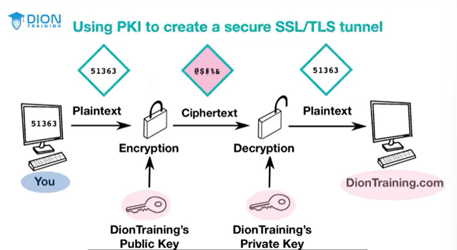
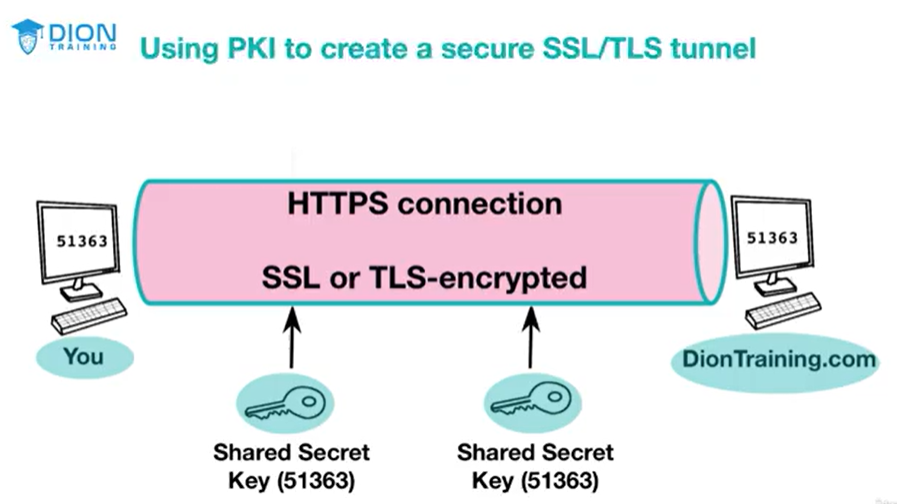

# Public Key Infrastructure (PKI)

An entire system of hardware, software, policies, procedures, and people that is based on [[Asymmetric Algorithms]]

- System that creates the asymmetrical key pairs that consist of those public and private keys that are used in the encryption and decryption process
 
 - Public Key Cryptography is just one small part of the overwall PKI Architecture

# Certificate Authority

Issues digital certificates and keeps the level of trust between all of the certificate authorities around the world

# Key Escrow

Process where cryptographic keys are stored ina  secure, third-party location, which is effectively an "escrow"

